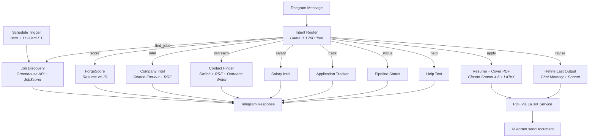

# CareerForge n8n

A single Telegram bot that handles your entire job search — morning digests, tailored resume + cover letter PDFs, company intel, cold outreach, and application tracking. Built entirely in [n8n](https://n8n.io), self-hosted, runs for ~$2/month after a one-time $10 OpenRouter deposit.

Demoed live at **n8n NYC Meetup, April 2026**.

---

## How It Works



---

## Features

| Intent | What it does | Example message |
|--------|-------------|-----------------|
| **find_jobs** | Searches Greenhouse ATS across 50 companies, scores fit, returns top 5 | "find AI jobs in NYC" |
| **apply** | Generates tailored resume + cover letter PDFs via LaTeX | "3" (applies to job #3 from last search) |
| **revise** | Iterates on the last resume/cover with chat memory | "make it shorter" |
| **score** | Scores your resume against a job description (0-10) | "score my resume for this role" |
| **intel** | Multi-source company health report (layoffs, funding, H1B, culture) | "intel about Databricks" |
| **outreach** | Finds recruiters/hiring managers + generates outreach variants | "who should I contact at Anthropic" |
| **salary** | Salary ranges + negotiation advice | "salary for ML Engineer at Stripe" |
| **track** | Logs and lists your applications | "track" |
| **status** | Pipeline status overview | "status" |
| **help** | Command list | "help" |

---

## Cost

| Service | Cost | What you get |
|---------|------|-------------|
| [OpenRouter](https://openrouter.ai) | $10 one-time deposit | 1,000 free model calls/day (forever) + paid models at ~$0.05/generation |
| [Telegram Bot API](https://core.telegram.org/bots) | Free | Unlimited messages + 50MB file delivery |
| [Firecrawl](https://firecrawl.dev) | Free (via OpenRouter plugin) | 100K scraping credits |
| [You.com](https://api.you.com) | Free ($100 credits) | 20K searches with LiveCrawl |
| [Serper](https://serper.dev) | Free (2,500 credits) | Google SERP fallback |
| **Monthly total** | **~$2/mo** | Paid model calls only (resume + cover letter generation) |

---

## Model Routing

Cheap/free models for classification and scoring. Paid models only where writing quality matters.

| Task | Model | Cost |
|------|-------|------|
| Intent routing | `meta-llama/llama-3.3-70b-instruct:free` | Free |
| Seniority detection | `deepseek/deepseek-chat-v3:free` | Free |
| Job scoring | `google/gemini-3-flash-lite` | ~$0.001/batch |
| ForgeScore | `deepseek/deepseek-chat-v3:free` | Free |
| Contact extraction | `deepseek/deepseek-chat-v3:free` | Free |
| Company intel synthesis | `deepseek/deepseek-chat-v3:free` | Free |
| **ResumeForge** | `anthropic/claude-sonnet-4.6` | ~$0.05 |
| **CoverForge** | `anthropic/claude-sonnet-4.6` | ~$0.05 |
| **Outreach writer** | `anthropic/claude-sonnet-4.6` | ~$0.05 |

---

## Quick Start

### Prerequisites

- [Docker Desktop](https://www.docker.com/products/docker-desktop/) running
- [ngrok](https://ngrok.com/) account (free tier works)
- API keys: OpenRouter (required), Telegram Bot (required), at least one search provider

### 1. Clone and configure

```bash
git clone https://github.com/Career-Forge/n8n.git
cd n8n/docker
cp .env.example .env
# Fill in your API keys in .env
```

### 2. Start services

```bash
docker compose up -d
# n8n:          http://localhost:5678
# LaTeX service: http://localhost:5679
```

### 3. Start ngrok tunnel

```bash
ngrok http 5678
# Copy the https://xxx.ngrok-free.app URL → set as WEBHOOK_URL in .env
# Restart n8n: docker compose restart n8n
```

### 4. Import the workflow

In n8n: **Workflows > Import from file** > select `workflows/01_careerforge.json`

### 5. Set up credentials

In n8n **Settings > Credentials**, create:

| Credential | Type | Header | Value |
|-----------|------|--------|-------|
| OpenRouter API | Header Auth | `Authorization` | `Bearer sk-or-v1-...` |
| Firecrawl API | Header Auth | `Authorization` | `Bearer fc-...` |
| You.com API | Header Auth | `X-API-Key` | your key |
| Serper API | Header Auth | `X-API-KEY` | your key |
| Telegram Bot | Telegram credential | — | Bot token from @BotFather |

Activate the workflow. Text your bot "help" to verify.

---

## Project Structure

```
careerforge-n8n/
|
|-- README.md                          # This file
|-- DEPLOYMENT.md                      # 4 hosting tiers (local to cloud)
|-- API.md                             # External services + cost math
|-- LICENSE                            # MIT
|-- PLAN.md                            # Refactor execution plan
|
|-- docs/
|   |-- QUICKSTART.md                  # Docker + ngrok 10-min setup
|   |-- MASTER_RESUME_GUIDE.md         # Template walkthrough
|   |-- CUSTOMIZE_PROMPTS.md           # Tune voice and style
|   |-- ARCHITECTURE.md                # System diagrams + deep dive
|   +-- diagrams/                      # Mermaid .mmd sources
|
|-- workflows/
|   +-- 01_careerforge.json            # THE workflow (single file)
|
|-- templates/
|   |-- master_resume_template.txt     # Fill-in-the-blank master resume
|   |-- master_resume_example.txt      # Worked example (fictional persona)
|   |-- resume_skeleton_fresher.tex    # LaTeX skeleton: <2 yrs experience
|   |-- resume_skeleton_experienced.tex # LaTeX skeleton: 2-10 yrs
|   |-- resume_skeleton_senior.tex     # LaTeX skeleton: 10+ yrs
|   +-- cover_skeleton.tex             # LaTeX skeleton: cover letter
|
|-- prompts/
|   |-- IntentRouter.md                # LLM intent classification
|   |-- SeniorityDetector.md           # Auto-detect fresher/experienced/senior
|   |-- ResumeForge_v3.md             # Tailored resume generation
|   |-- CoverForge_v3.md              # Cover letter generation
|   |-- ResumeRefine.md               # Iterative resume refinement
|   |-- CoverRefine.md                # Iterative cover refinement
|   |-- ForgeScore_v3.md              # Resume vs JD scoring (0-10)
|   |-- JobScorer.md                   # Batch job ranking
|   |-- ContactFinder.md              # Extract contacts from search results
|   |-- OutreachWriter.md             # Multi-variant outreach generation
|   +-- CompanyIntel.md               # Company health report
|
|-- services/
|   +-- latex/
|       |-- Dockerfile
|       +-- app.py                     # Flask + pdflatex PDF compiler
|
|-- docker/
|   |-- docker-compose.yml             # n8n + LaTeX service
|   |-- .env.example                   # All API keys documented
|   +-- README.md
|
+-- scripts/
    +-- DEMO_SCRIPT.md                 # Meetup demo walkthrough
```

---

## How the Resume Pipeline Works

1. You text a job number (e.g., "3") after a job search
2. **SeniorityDetector** reads your master resume, picks the right LaTeX skeleton (fresher/experienced/senior)
3. **ForgeScore** scores your fit (0-10). Below 6? You get a warning with specific gaps
4. **ResumeForge** (Claude Sonnet 4.6) generates structured JSON — tailored bullets, keyword-aligned, metric-preserved
5. A JS node deterministically fills the LaTeX skeleton with the JSON content
6. **LaTeX service** compiles to PDF
7. Same flow for **CoverForge** (runs in parallel)
8. Both PDFs delivered via Telegram `sendDocument`
9. Reply "make it shorter" or "more Python" to iterate — chat memory preserves context

---

## Search Fan-out + RRF Merge

The outreach and intel branches use a Switch node to fire configured search providers in parallel:

```
Switch: Which providers are configured?
  |-- Firecrawl (if FIRECRAWL_API_KEY set)
  |-- You.com   (if YOUCOM_API_KEY set)
  |-- Serper    (if SERPER_API_KEY set)
  +-- Fallback  (none configured → helpful error)

Results merge via Reciprocal Rank Fusion (RRF):
  score(doc) = sum(1 / (k + rank_i)) across all providers

Top 15 deduped results → LLM extraction
```

Configure 1, 2, or 3 providers. The system gracefully degrades — works with any combination.

---

## Status

| Component | Status |
|-----------|--------|
| Intent router (10 intents) | In progress |
| find_jobs (Greenhouse + scoring) | In progress |
| apply (PDF pipeline) | In progress |
| revise (chat memory iteration) | Planned |
| score (ForgeScore standalone) | Planned |
| intel (company health) | Planned |
| outreach (contact finder + writer) | Planned |
| salary / track / status | Planned |
| LaTeX PDF service | Working |
| Deployment configs | Planned |

---

## Contributing

Issues and PRs welcome. See [ARCHITECTURE.md](docs/ARCHITECTURE.md) for system design details.

## License

[MIT](LICENSE)
