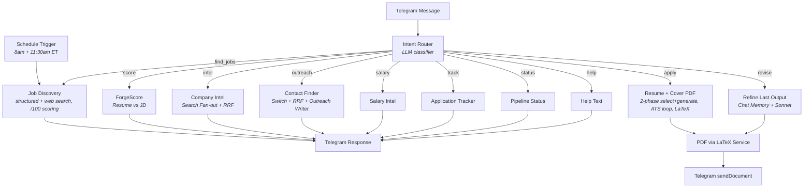

# CareerForge n8n

A single Telegram bot that handles your entire job search — morning digests, tailored resume + cover letter PDFs, company intel, cold outreach, and application tracking. Built entirely in [n8n](https://n8n.io), self-hosted, runs for ~$2/month after a one-time $10 OpenRouter deposit.

Demoed live at **n8n NYC Meetup, April 2026**.

> **Setting it up?** See **[SETUP.md](SETUP.md)** for the full clone-and-BYOK guide — Docker stack, the credentials to create, `app_settings` rows, free-vs-premium providers, the central model map, and how to switch on premium contacts (Apollo/Hunter).

---

## How It Works



---

## Features

| Intent | What it does | Example message |
|--------|-------------|-----------------|
| **find_jobs** | Searches structured job APIs + a pgvector/tsvector job cache + web, dedupes, scores fit **/100** with sub-scores, returns top matches | "find AI jobs in NYC" |
| **apply** | 2-phase engine: selects content against the JD, frames bullets to **researched company values + mission**, scores **ATS** and auto-improves if weak — then resume + cover PDFs | "3" (applies to job #3 from last search) |
| **revise** | Iterates on the last resume/cover with chat memory | "make it shorter" |
| **score** | Scores your resume against a job description (**0-100**, explainable) | "score my resume for this role" |
| **intel** | Multi-source company health report (layoffs, funding, H1B, culture, **mission/vision**), cached | "intel about Databricks" |
| **outreach** | Finds real recruiters/hiring managers + writes outreach citing a **real public hook**; optional verified contacts (Apollo/Hunter, BYOK). Reply "draft 1" for a specific contact's variants | "who should I contact at Anthropic" |
| **salary** | Salary ranges + negotiation advice | "salary for ML Engineer at Stripe" |
| **track** | Logs and lists your applications | "track" |
| **status** | Pipeline status overview | "status" |
| **setup_resume** | Upload/set up your master resume (interactive JSON template) | send a resume file, or "set up my resume" |
| **view_prefs** | Show your saved preferences | "/prefs" |
| **update_prefs** | Save a durable preference | "remember I need cap-exempt sponsors" |
| **forget_pref** | Remove a saved preference | "/prefs forget location" |
| **verbose_toggle** | Toggle showing search queries/reasoning | "/verbose on" |
| **check_resume** | Check whether a resume is saved | "do you have my resume?" |
| **costs** | Spend summary from `tool_cost_log` (last 30 days) — currently populated for Apollo enrichment calls; OpenRouter/search-provider spend isn't logged to this table yet, check your OpenRouter dashboard for that | "costs" |
| **jd_paste** | Paste a full job description directly — no search needed | paste a job posting's full text |
| **help** | Command list | "help" |

---

## Mini App

Everything above also works as a real UI, not just chat. The bot's Telegram menu button opens a **Mini App** — a FastAPI sidecar + React frontend rendered inside Telegram, with its own HMAC-validated auth (initData signature check + a hard owner allowlist, since this is still a single-user bot):

| Screen | What it shows |
|--------|---------------|
| **Home** | Stats strip — jobs found, applications tracked, resume ForgeScore |
| **Jobs** | The last digest as a real table — source-trust badges, match %, status color-coding |
| **Tracker** | A 5-column kanban (saved → applied → interviewing → offer → rejected), drag to update |
| **Resume** | Your ForgeScore as a ring, plus the underlying resume data |
| **Settings** | A read-only view of your saved preferences |

Actions taken in the app (mark applied, run a search, log a tracked application) go through the exact same pipeline as typing in chat — the app POSTs a synthetic Telegram update to the bot's own webhook, so there's no second copy of any logic to keep in sync. See [miniapp/README.md](miniapp/README.md) for the architecture, and the Quick Start below for exposing it.

---

## Cost

| Service | Cost | What you get |
|---------|------|-------------|
| [OpenRouter](https://openrouter.ai) | $10 one-time deposit | 1,000 free model calls/day (forever) + paid models at ~$0.05/generation |
| [Telegram Bot API](https://core.telegram.org/bots) | Free | Unlimited messages + 50MB file delivery |
| [Firecrawl](https://firecrawl.dev) | Free (via OpenRouter plugin) | 100K scraping credits |
| [You.com](https://api.you.com) | Free ($100 credits) | 20K searches with LiveCrawl |
| [Serper](https://serper.dev) | Free (2,500 credits) | Google SERP fallback |
| **Monthly total** | **~$2/mo** | Paid model calls only (resume + cover letter generation) |

---

## Model Routing

Cheap/free models for classification and scoring. Paid models only where writing quality matters.

| Task | Model | Cost |
|------|-------|------|
| Intent routing | `openai/gpt-5.4-mini` | ~$0.001/call |
| Seniority detection | `deepseek/deepseek-v4-flash` | ~$0.001/call |
| Job scoring | `deepseek/deepseek-v4-pro` | ~$0.005/batch |
| ForgeScore | `deepseek/deepseek-v4-flash` | ~$0.001/call |
| Contact extraction | `deepseek/deepseek-v4-flash` | ~$0.001/call |
| Company intel synthesis | `deepseek/deepseek-v4-flash` | ~$0.001/call |
| Salary analysis | `deepseek/deepseek-v4-flash` | ~$0.001/call |
| **ResumeForge / CoverForge** | `anthropic/claude-sonnet-4-6` | ~$0.05 |
| **Outreach writer** | `anthropic/claude-sonnet-4-6` | ~$0.05 |

Costs above are directional (verify current OpenRouter pricing at [openrouter.ai/models](https://openrouter.ai/models) before relying on them) — model IDs are pulled directly from the live workflow's `*Model` nodes, so those are authoritative.

---

## Quick Start

### Prerequisites

- [Docker Desktop](https://www.docker.com/products/docker-desktop/) running
- [ngrok](https://ngrok.com/) account (free tier works)
- API keys: OpenRouter (required), Telegram Bot (required), at least one search provider

### 1. Clone and configure

```bash
git clone https://github.com/Career-Forge/n8n.git
cd n8n/docker
cp .env.example .env
# Fill in your API keys in .env
```

### 2. Start services

```bash
docker compose up -d
# n8n:          http://localhost:5678
# LaTeX service: http://localhost:5679
```

### 3. Start ngrok tunnel

```bash
ngrok http 5678
# Copy the https://xxx.ngrok-free.app URL → set as WEBHOOK_URL in .env
# Restart n8n: docker compose restart n8n
```

### 4. Import the workflow

In n8n: **Workflows > Import from file** > select `workflows/CareerForge_Master_local.json` (the master bot), then repeat for `workflows/CareerForge_ATS_Poller.json` (background job-registry poller) and `workflows/CareerForge_Registry_Seeder.json` (one-time registry seed). Activate all three. See [SETUP.md](SETUP.md) for the full recipe, including the Postgres schema and Ollama embedding model.

### 5. Set up credentials

In n8n **Settings > Credentials**, create:

| Credential | Type | Setting | Value |
|-----------|------|---------|-------|
| OpenRouter API | **OpenAI-compatible** | Base URL | `https://openrouter.ai/api/v1` |
| OpenRouter API | OpenAI-compatible | API Key | `sk-or-v1-...` |
| Firecrawl API | Header Auth | `Authorization` | `Bearer fc-...` |
| You.com API | Header Auth | `X-API-Key` | your key |
| Serper API | Header Auth | `X-API-KEY` | your key |
| Telegram Bot | Telegram API | — | Bot token from @BotFather |

Activate the workflow. Text your bot "help" to verify.

### 6. (Optional) Turn on the Mini App

`docker compose up -d` already started it (`docker/.env.example` documents the extra required vars: `MINIAPP_BRIDGE_SECRET`, `OWNER_TG_USER_ID`, `N8N_TG_WEBHOOK_SECRET`, `MINIAPP_PUBLIC_URL`) — it just isn't reachable from Telegram until you expose it over HTTPS and point the bot's menu button at it. See [miniapp/README.md](miniapp/README.md) for the exposure step (Tailscale Funnel or similar) and BotFather setup.

---

## Project Structure

```
careerforge-n8n/
|
|-- README.md                          # This file
|-- SETUP.md                           # Full clone-and-BYOK guide
|-- DEPLOYMENT.md                      # 5 hosting tiers (local to cloud)
|-- API.md                             # External services + cost math
|-- ROADMAP.md                         # What's live, what's next
|-- LICENSE                            # AGPL-3.0
|
|-- docs/
|   |-- QUICKSTART.md                  # Docker + ngrok 10-min setup
|   |-- MASTER_RESUME_GUIDE.md         # Template walkthrough
|   |-- CUSTOMIZE_PROMPTS.md           # Tune voice and style
|   |-- ARCHITECTURE.md                # System diagrams + deep dive
|   |-- ADAPTER_EXPANSION.md           # Design plan: next-wave ATS adapters (Meta/Google/Microsoft/Workday-bulk)
|   |-- archive/                       # Superseded planning docs -- historical only
|   +-- diagrams/                      # Mermaid .mmd sources
|
|-- workflows/
|   |-- CareerForge_Master_local.json  # THE bot (master workflow)
|   |-- CareerForge_ATS_Poller.json    # Background job-registry poller
|   |-- CareerForge_Registry_Seeder.json # One-time registry seed
|   +-- archive/                       # Historical snapshots -- do not import
|
|-- templates/
|   +-- cover_skeleton.tex             # LaTeX skeleton (resume uses one shared skeleton in code, no seniority variants)
|
|-- prompts/                           # LLM prompts, regenerated from the live workflow (`node scripts/export_prompts.js`)
|   |-- IntentRouter.md                # LLM intent classification
|   |-- SeniorityDetector.md           # Auto-detect fresher/junior/mid/senior
|   |-- Pass1_Resume.md               # Resume content selection (adaptive to career tier)
|   |-- Pass2_Resume.md               # Resume bullet writing
|   |-- Cover_Pass1.md / Cover_Pass2.md # Cover letter selection + writing
|   |-- ReviseForge.md                # "make it shorter" style resume revisions
|   |-- ForgeScore_v3.md              # Resume vs JD scoring
|   |-- JobScorer.md                   # Job ranking + location matching
|   |-- ContactFinder.md              # Extract contacts from search results
|   |-- OutreachWriter.md             # Multi-variant outreach generation
|   +-- CompanyIntel.md               # Company health report
|   (see docs/CUSTOMIZE_PROMPTS.md for the full, current list)
|
|-- services/
|   +-- latex/
|       |-- Dockerfile
|       +-- app.py                     # Flask + pdflatex PDF compiler
|
|-- miniapp/                           # Telegram Mini App -- rich UI (see miniapp/README.md)
|   |-- api/                           # FastAPI sidecar: HMAC-validated Telegram auth, snapshot/actions/tracker routes
|   +-- web/                           # React + Vite + TypeScript frontend (Home/Jobs/Tracker/Resume/Settings)
|
|-- db/
|   +-- schema.sql                     # Postgres + pgvector schema (companies, jobs, tier_weight, app_settings, ...)
|
|-- data/
|   +-- reference/                     # Local gazetteer (34k cities), company tier weights, H1B sponsor data
|       |-- geonames_cities.json       # GeoNames gazetteer -- location matching for find_jobs
|       |-- company_tiers.json         # Fortune 500 + hand-curated tier weights -- ⭐ badge, scoring
|       |-- h1b_sponsors.json          # USCIS H1B approval data -- workauth scoring
|       +-- README.md                  # Sources, licenses, regeneration instructions
|
|-- docker/
|   |-- docker-compose.yml             # n8n + LaTeX (local dev)
|   |-- docker-compose.render.yml      # Render free tier (SQLite)
|   |-- Dockerfile.render              # Render/Railway image (bakes templates in)
|   |-- render.yaml                    # Render Blueprint
|   |-- railway.json                   # Railway config
|   |-- .env.example                   # All API keys documented
|   +-- README.md
|
+-- scripts/                           # Patch scripts (deploy history, s1-s144+) + one-off utilities + build_reference_data.js
    +-- uptime_ping.sh                 # Keep-alive ping for Render free tier
```

---

## How the Resume Pipeline Works

1. You text a job number (e.g., "3") after a job search
2. **SeniorityDetector** classifies your career tier (fresher/junior/mid/senior) — there's one shared resume skeleton; tier instead drives an adaptive content plan (how many roles/projects/bullets to select and how long each bullet runs, enforced deterministically in code, not left to the LLM)
3. **ForgeScore** scores your fit (0-10). Below 6? You get a warning with specific gaps
4. **ResumeForge** (Claude Sonnet 4.6) generates structured JSON — tailored bullets, keyword-aligned, metric-preserved
5. A JS node deterministically fills the LaTeX skeleton with the JSON content
6. **LaTeX service** compiles to PDF
7. Same flow for **CoverForge** (runs in parallel)
8. Both PDFs delivered via Telegram `sendDocument`
9. Reply "make it shorter" or "more Python" to iterate — chat memory preserves context

---

## Search Fan-out + RRF Merge

The outreach and intel branches use a Switch node to fire configured search providers in parallel:

```
Switch: Which providers are configured?
  |-- Firecrawl (if FIRECRAWL_API_KEY set)
  |-- You.com   (if YOUCOM_API_KEY set)
  |-- Serper    (if SERPER_API_KEY set)
  +-- Fallback  (none configured → helpful error)

Results merge via Reciprocal Rank Fusion (RRF):
  score(doc) = sum(1 / (k + rank_i)) across all providers

Top 15 deduped results → LLM extraction
```

Configure 1, 2, or 3 providers. The system gracefully degrades — works with any combination.

---

## Status

| Component | Status |
|-----------|--------|
| Intent router (18 intents) | Complete |
| find_jobs (12+ ATS APIs + web search, gazetteer location match, tier/H1B-aware scoring) | Complete |
| apply (PDF pipeline) | Complete |
| revise (chat memory iteration) | Complete |
| score (ForgeScore standalone) | Complete |
| intel (company health) | Complete |
| outreach (contact finder + writer) | Complete |
| salary / track / status | Complete |
| LaTeX PDF service | Complete |
| Deployment configs (5 tiers) | Complete |

---

## Contributing

Issues and PRs welcome. See [ARCHITECTURE.md](docs/ARCHITECTURE.md) for system design details.

## License

[AGPL-3.0](LICENSE)
