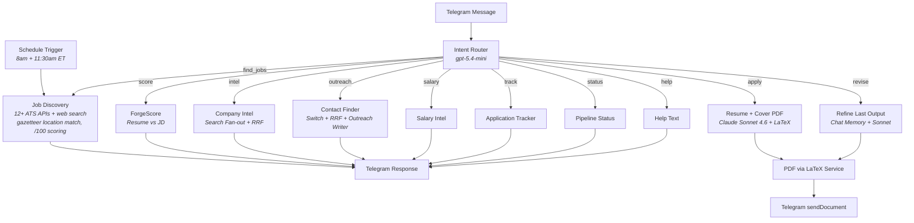
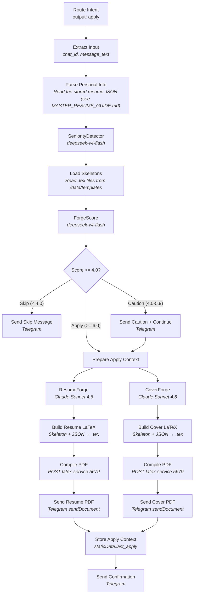
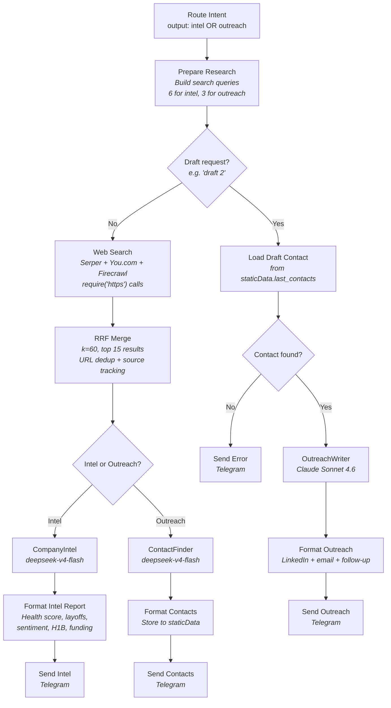

# Architecture

CareerForge is a single n8n workflow (321 nodes) that handles 18 intents through one Telegram bot, plus a separate background poller workflow (18 nodes) that keeps a local job cache warm across 16 ATS platforms. This doc walks through the system design, data flow, and key implementation patterns.

## System Overview



Every message hits the Intent Router first. It's an Agent-architecture node (needs native tool-calling for structured output) running `openai/gpt-5.4-mini`. The router outputs a JSON object with `intent` and `entities` — a Switch node fans out to the matching branch.

## Intent Router

The router classifies into 18 intents and extracts entities (company, role, location, job number). Key design choice: using an LLM router instead of regex means users can say "who should I reach out to at Stripe" and it correctly maps to `outreach` with `company: Stripe`. No keyword matching, no training data.

The router prompt lives in `prompts/IntentRouter.md`. It includes few-shot examples for ambiguous cases (e.g., a bare number like "3" maps to `apply` if there's a recent job search).

## Apply Pipeline — PDF Generation

The heaviest branch. Turns a user message like "apply to job 3" into two tailored PDFs delivered via Telegram.



### How PDF generation works

1. **SeniorityDetector** classifies the candidate as `fresher`, `experienced`, or `senior`. This picks the LaTeX skeleton — each has a structurally different layout optimized for that career stage.

2. **ForgeScore** scores the resume against the job description (0-10 across 6 dimensions). If the score is below 4.0, the pipeline stops and tells the user to skip. Between 4.0-5.9, it warns but continues.

3. **ResumeForge** and **CoverForge** run in parallel (both are Claude Sonnet 4.6). They output structured JSON — not LaTeX. The JSON schema is strict: bullet text capped at 110 chars, max 6 entries, no hallucinated metrics.

4. **Build LaTeX** nodes take the JSON and inject it into the selected skeleton using marker-based replacement (`%%% HEADER_START/END`, `%%% CONTENT_START/END`). This is a deterministic Code node — no LLM involved.

5. **Compile PDF** sends the `.tex` source to the LaTeX microservice (Flask + pdflatex), which returns a binary PDF.

6. **Store Apply Context** saves the full context to `staticData.last_apply` so the revise branch can access it later.

### LaTeX service

A minimal Flask app (`services/latex/app.py`) that accepts raw LaTeX via POST and returns a compiled PDF. Uses `pdflatex` with a 60-second timeout. The Dockerfile pulls the full TeX Live distribution (~2GB), so first build takes a while.

## Search + RRF Merge

The intel and outreach branches share a search infrastructure. Instead of relying on a single search provider, CareerForge fans out to up to 3 providers and merges results using Reciprocal Rank Fusion.



### Why RRF?

Each search provider returns results in its own ranking. Serper gives Google SERP order, You.com ranks by its own relevance model, and Firecrawl returns full-page markdown content. RRF (Reciprocal Rank Fusion) combines these rankings without needing to understand the scoring functions. The formula is simple: `score += 1 / (k + rank)` for each provider that returns the URL. Results appearing in multiple providers get boosted.

The k=60 smoothing constant is standard in IR literature. We take the top 15 after dedup (URLs are normalized by stripping tracking params like `utm_source`, `fbclid`, etc.).

### Why not n8n's Merge node?

The original PLAN.md called for a Switch → 3 HTTP nodes → Merge pattern. But n8n's Merge node in "append" mode blocks forever if any connected input never fires. If a user only configures 1 of 3 search providers, the unconfigured branches never send data, and Merge hangs. Solution: a single Code node using `require('https')` that calls all configured providers internally. No hanging, no fan-out complexity.

## Revise Branch

The revise branch handles iterative refinement — "make it shorter", "emphasize Python more", "change the hook". It loads the previous apply context from `staticData.last_apply` and runs the revised content through the same PDF pipeline.

Key design: the ReviseForge node includes both `ResumeRefine` and `CoverRefine` prompts with a conditional instruction telling the model which to follow based on `revise_type`. The type is detected via regex on the user's message (mentions of "cover letter" or "cl" → cover, else resume).

## Data Flow — staticData

n8n's `$getWorkflowStaticData('global')` persists data across executions without an external database. CareerForge uses it for:

| Key | Purpose | Set by | Read by |
|-----|---------|--------|---------|
| `last_apply` | Full context from most recent apply (resume JSON, cover JSON, job description, personal info, skeletons) | Store Apply Context (cf-083) | Revise, Score branches |
| `tracked_applications` | Array of tracked job applications | Track Application (cf-100) | Status branch (cf-102) |
| `last_contacts` | Contacts from most recent outreach search | Format Contacts (cf-153) | Draft path (cf-155) |

This means CareerForge works with SQLite — no Postgres required for basic functionality.

## Model Routing

Cheap/fast models handle classification and extraction. Paid models handle writing.

| Task | Model | Cost | Why |
|------|-------|------|-----|
| Intent routing | `openai/gpt-5.4-mini` | ~$0.001 | Fast, reliable classification, native tool-calling |
| Seniority detection | `deepseek/deepseek-v4-flash` | ~$0.001 | Simple JSON output |
| ForgeScore | `deepseek/deepseek-v4-flash` | ~$0.001 | Structured scoring |
| Job scoring | `deepseek/deepseek-v4-pro` | ~$0.005 | Quality matters for ranking |
| Resume generation | `anthropic/claude-sonnet-4-6` | ~$0.05 | Writing quality |
| Cover letter | `anthropic/claude-sonnet-4-6` | ~$0.05 | Writing quality |
| Outreach drafts | `anthropic/claude-sonnet-4-6` | ~$0.05 | Tone sensitivity |
| Contact extraction | `deepseek/deepseek-v4-flash` | ~$0.001 | Pattern matching |
| Company intel | `deepseek/deepseek-v4-flash` | ~$0.001 | Source synthesis |
| Salary analysis | `deepseek/deepseek-v4-flash` | ~$0.001 | Data summarization |

All models route through OpenRouter — model IDs above are pulled directly from the live workflow's `*Model` nodes; verify current pricing at [openrouter.ai/models](https://openrouter.ai/models) before relying on the Cost column.

## Deployment Tiers

```mermaid
flowchart LR
    subgraph T0["Tier 0 — Local"]
        direction TB
        T0_COST["$0"]
        T0_DESC["Docker + ngrok<br/>Laptop must stay on"]
    end

    subgraph T1["Tier 1 — Render Free"]
        direction TB
        T1_COST["$0"]
        T1_DESC["SQLite + disk<br/>UptimeRobot keep-alive<br/>750 hrs/mo, cold starts"]
    end

    subgraph T2["Tier 2 — Railway"]
        direction TB
        T2_COST["$5/mo"]
        T2_DESC["Postgres included<br/>No cold starts<br/>Auto-deploy on push"]
    end

    subgraph T3["Tier 3 — Hetzner VPS"]
        direction TB
        T3_COST["$4.59/mo"]
        T3_DESC["CX22 (2 vCPU, 4GB)<br/>Caddy + systemd<br/>Full control, daily backups"]
    end

    subgraph T4["Tier 4 — n8n Cloud"]
        direction TB
        T4_COST["$20/mo"]
        T4_DESC["Managed, zero ops<br/>Import JSON + activate<br/>2500 executions/mo"]
    end

    T0 -->|"Want 24/7?"| T1
    T1 -->|"Need reliability?"| T2
    T2 -->|"Want full control?"| T3
    T3 -->|"Want zero ops?"| T4
```



See [DEPLOYMENT.md](../DEPLOYMENT.md) for step-by-step instructions for each tier.

## ATS Poller & Adapter Roadmap

`CareerForge_ATS_Poller.json` polls 16 ATS platforms directly into a local job cache, so `find_jobs` can hit a warm cache before falling back to live web search: 11 genuinely multi-tenant adapters (Greenhouse, Lever, Ashby, Workable, Recruitee, SmartRecruiters, Workday, Eightfold, Avature, Oracle Cloud HCM, SuccessFactors — any company on that platform can be added by seeding a tenant slug, no new code) plus 5 single-company bespoke integrations (Amazon, Apple, Google, Microsoft, D.E. Shaw — each is a fixed, hardcoded endpoint). See [docs/ADAPTER_EXPANSION.md](ADAPTER_EXPANSION.md) for the one remaining gap (Meta) and the SmartRecruiters/Eightfold tenant-discovery problem.

## File Map

```
workflows/CareerForge_Master_local.json   ← THE bot (321 nodes)
workflows/CareerForge_ATS_Poller.json     ← Background job-registry poller (18 nodes, 16 ATS platforms)
workflows/CareerForge_Registry_Seeder.json ← One-time registry seed
workflows/archive/                        ← Historical snapshots, do not import
prompts/*.md                              ← LLM prompt source files (regenerated from live via scripts/export_prompts.js)
templates/cover_skeleton.tex              ← LaTeX skeleton (resume uses one shared skeleton, no seniority variants)
services/latex/                           ← Flask PDF compiler
db/schema.sql                             ← Postgres + pgvector schema (companies, jobs, tier_weight, app_settings, ...)
data/reference/                           ← Local gazetteer (34k cities), company tier weights, and H1B sponsor data -- see data/reference/README.md
docker/                                   ← Docker configs (n8n, postgres, ollama, latex)
scripts/                                  ← Patch scripts (deploy history) + utilities
```

> **Heads up:** the diagrams below (`system_overview.mmd`, `apply_pipeline.mmd`, `outreach_rrf.mmd`) describe an earlier iteration of the pipeline (single-phase ResumeForge/CoverForge, a standalone RRF-merge node) and have not been re-verified against the current 302-node local-Postgres/pgvector architecture. Treat them as historically informative, not as current ground truth, until they're regenerated.

## Diagram Sources

Mermaid source files for all diagrams live in `docs/diagrams/`:

- [`system_overview.mmd`](diagrams/system_overview.mmd)
- [`apply_pipeline.mmd`](diagrams/apply_pipeline.mmd)
- [`outreach_rrf.mmd`](diagrams/outreach_rrf.mmd)
- [`deployment_tiers.mmd`](diagrams/deployment_tiers.mmd)
